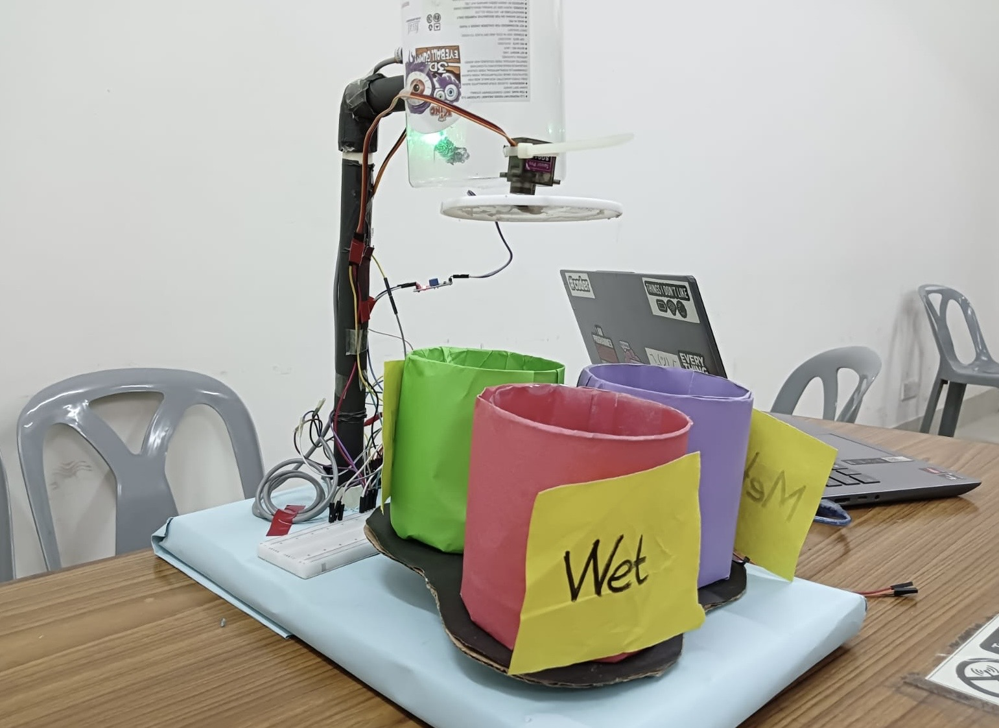

# Smart Dustbin 🚮 – Waste Segregation System

An Arduino-based smart dustbin that automatically detects and classifies waste as **Wet**, **Dry**, or **Metal** using sensors. It improves hygiene, reduces manual sorting, and supports smart city infrastructure.

---

##  Objective

- Promote hygienic and eco-friendly waste disposal
- Reduce human contact with waste
- Automatically classify and sort waste using sensors and motors

---

##  How It Works

1. **IR sensor** detects the presence of waste
2. **Servo motor** opens the lid automatically
3. **Moisture sensor** and **metal detector** classify the waste:
   - Moisture detected → Wet Waste
   - Metal detected → Metal Waste
   - None → Dry Waste
4. **Stepper motor** rotates sorting flap to appropriate bin
5. **Buzzer** beeps after sorting
6. Waits for the item to be removed before detecting the next

---

##  Components Used

| Component              | Purpose                            |
|------------------------|-------------------------------------|
| Arduino Uno            | Microcontroller                    |
| IR Sensor              | Detects approaching waste          |
| Moisture Sensor        | Detects wetness                    |
| Metal Detector         | Detects metal objects              |
| Servo Motor            | Opens/closes lid                   |
| Stepper Motor & Driver | Rotates sorting mechanism          |
| Buzzer                 | Feedback after sorting             |
| Power Supply           | Powers components                  |

---

##  Project Images

### 📊 Circuit Diagram

  
   
  <b>Figure 1:</b> Circuit Diagram of Smart Dustbin

> This is the full circuit layout of the Smart Dustbin system.  
> It shows how the sensors (IR, Moisture, Metal), servo motor, stepper motor, and buzzer are connected to the Arduino Uno. This diagram is essential for understanding the physical wiring of the hardware.

---

### 🔌 Arduino Uno with Connected Components

  
   
  <b>Figure 2:</b> Arduino Uno with Connected Components

> This image displays the actual Arduino Uno board with all components connected.  
> You can see how sensors and motors are connected with jumper wires. This helps visualize the hardware setup and real-life implementation beyond just the circuit diagram.
---

### 📸 Project Showcasing

> This image shows the final assembled Smart Dustbin during demonstration.  
> It includes the dustbin housing, connected sensors, and the working mechanism for automatic lid opening and waste sorting. It’s useful for seeing the overall integration of hardware in a real container.

